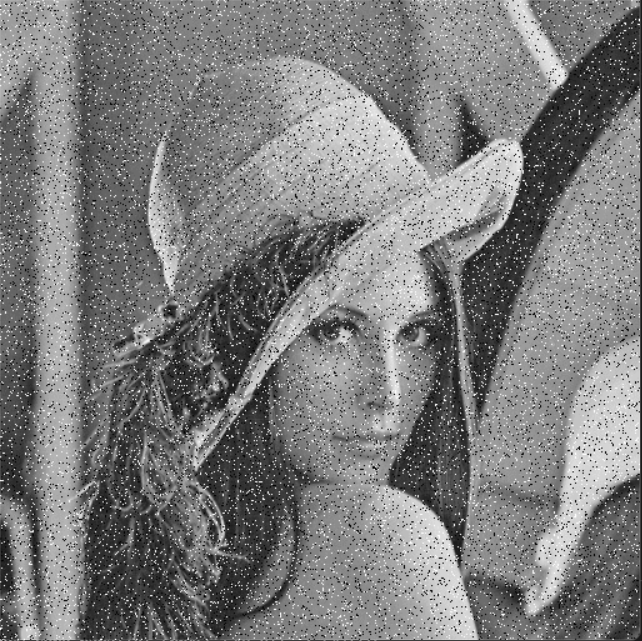
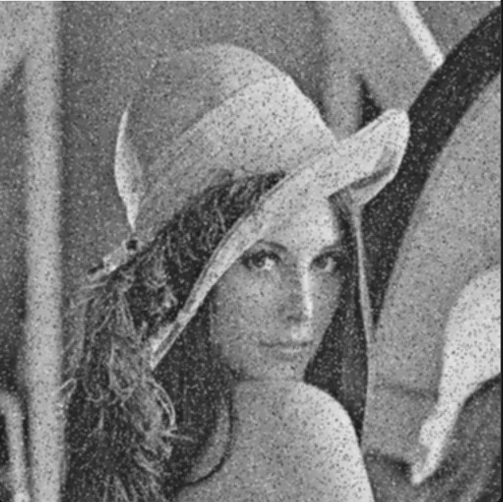
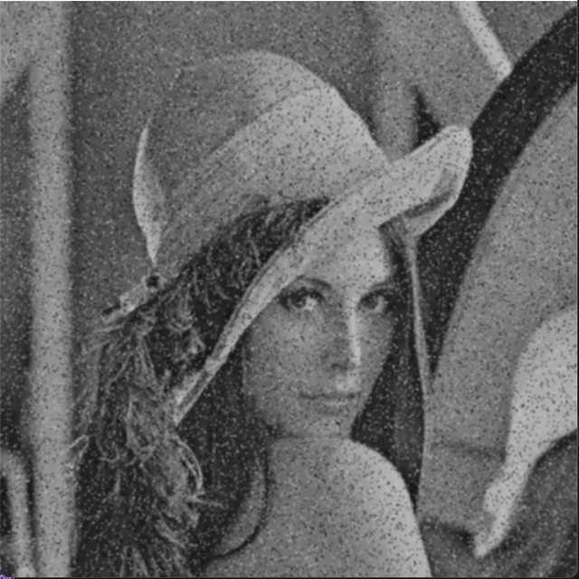

# Computer Vision Project 1
In this project we have implemented some Image Processing Techniques implemented from scratch using C++, we have implemented our Techniques in this readme in lenna image for more illustration.

##### Lenna Image

<br>
### Prerequsites
1. Visual Studio C++ Workload
2. OpenCV
3. CMake

<br>

### Build
1. Configure project.

*N.b* use only after cloning or changing *CMakeLists.txt*.
```sh
$ cmake . -B ./build
```
2. Build the executable
```sh
$ cmake --build ./build/
```
3. The executable will be in the *build/Debug/* folder
```sh
$ build/Debug/cv-project-1.exe
```
4. Clean the build folder (Optional)
```sh
$ cmake --build ./build/ --target clean
```


<br>
## 1. Adding Noise To Image

Three types of noise are implemented in this project: Uniform, Gaussian, and Salt & Pepper noise

`img::Image add_noise(img::Image image , std::string type ,uchar noise_factor) `

#### Parameters 

` image ` : the image on which the should be added, it should be of class img::Image which is implemented in this project.
` type ` : the type of noise you want to add, there are three types you must write any one of them "Gaussian", "Uniform" , and "Salt".
` noise_factor ` : It's the ratio of the noise in the image.

#### Examples

##### 1.1 Uniform Noise


##### 1.2 Gaussian Noise


##### 1.3 Salt & Pepper Noise


<br>
## 2. Image Filtering

Three types of noise are implemented in this project: Median, Mean, and Gaussian filters.

`img::Image noise_filter(img::Image source,int size, std::string type  ,double std=1) `

#### Parameters 

` image ` : the image on which the should be added, it should be of calse img::Image
` type ` : the type of noise filter you want to apply, there are three types you must write any one of them "Gaussian", "Mean" , and "Median".
` std ` : It's the standard deviation of the gaussian kernal, it has a default value equals 1, It should be used only when using Gaussian filter unless it will be useless.
#### Examples
The following examples for filttering the Salt & Pepper noise implemented in this project.

##### 2.1 Median Filter


##### 2.2 Mean Filter


##### 2.3 Gaussian Filter
